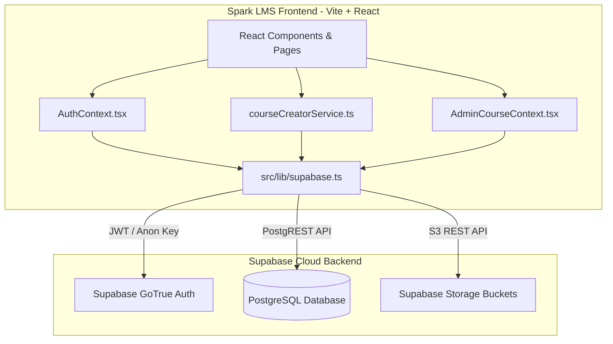
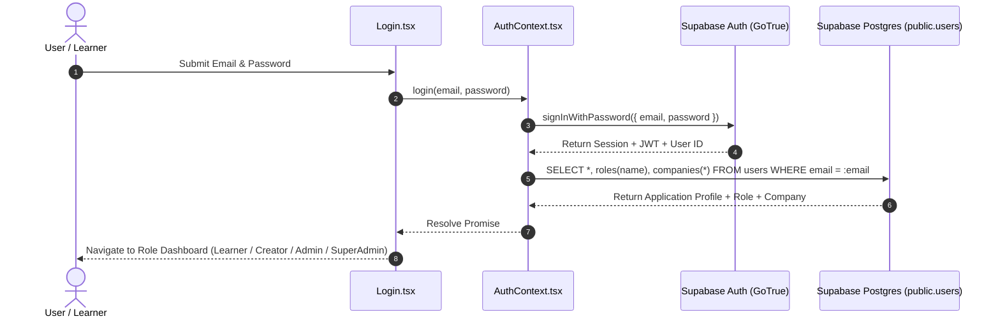
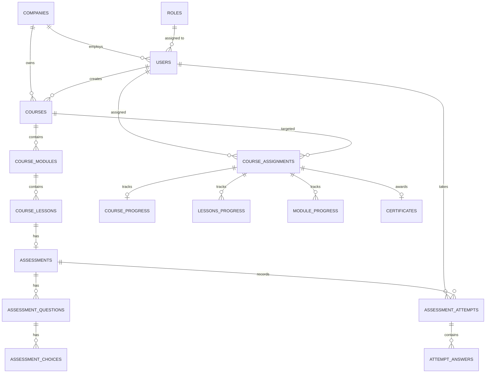

# Supabase Database & Backend Integration Guide

> [!NOTE]
> This document details the end-to-end architecture, configuration, database schema, authentication flow, storage integration, and data access patterns used to connect **Spark LMS** to **Supabase**.

---

## Architecture Overview

Spark LMS connects directly to Supabase from the client-side single-page application (SPA) using the official `@supabase/supabase-js` SDK. All client-side requests are authenticated through JSON Web Tokens (JWT) issued by Supabase Auth and governed by PostgreSQL Row-Level Security (RLS) policies.



---

## 1. Environment Configuration & Client Setup

### 1.1 Environment Variables
Vite requires client-exposed environment variables to start with the `VITE_` prefix. These are defined in the project root [`.env`](file:///c:/Users/yani/Documents/spark-lms/spark-lms/.env):

```env
VITE_SUPABASE_URL=https://<your-project-ref>.supabase.co
VITE_SUPABASE_ANON_KEY=sb_publishable_<your-anon-key>
```

> [!IMPORTANT]
> - `VITE_SUPABASE_URL`: The unique HTTPS endpoint for your Supabase project API gateway.
> - `VITE_SUPABASE_ANON_KEY`: The public/anonymous key. It is safe for exposure in client-side bundles because database access is secured by PostgreSQL Row-Level Security (RLS). Never place `SUPABASE_SERVICE_ROLE_KEY` in frontend code.

### 1.2 Client Initialization
The singleton client instance is initialized in [`src/lib/supabase.ts`](file:///c:/Users/yani/Documents/spark-lms/spark-lms/src/lib/supabase.ts):

```typescript
import { createClient } from '@supabase/supabase-js';

const supabaseUrl = import.meta.env.VITE_SUPABASE_URL;
const supabaseKey = import.meta.env.VITE_SUPABASE_ANON_KEY;

export const supabase = createClient(supabaseUrl, supabaseKey);
```

Any component, hook, or service requiring database or auth capabilities imports this single client:
```typescript
import { supabase } from '../../lib/supabase';
```

---

## 2. Authentication & User Profile Synchronization

Authentication and user context are handled centrally by [`AuthProvider`](file:///c:/Users/yani/Documents/spark-lms/spark-lms/src/context/AuthContext.tsx) in `src/context/AuthContext.tsx`.

### 2.1 Two-Tier Identity Model
1. **`auth.users` (Supabase Internal)**: Stores authentication credentials (email, hashed password, confirmation tokens, session JWTs).
2. **`public.users` (Application Data)**: Stores LMS business fields (names, employee IDs, department, job title, company association, role).
3. **Primary Key Alignment**: The primary key `public.users.id` is mapped directly to `auth.users.id` (UUID), linking identity with application data without dual-maintenance overhead.



### 2.2 Relational Joining on Login
When a user signs in, [`fetchUserProfile`](file:///c:/Users/yani/Documents/spark-lms/spark-lms/src/context/AuthContext.tsx#L66-L98) performs a PostgREST nested join to retrieve the user's role and multi-tenant company in a single HTTP request:

```typescript
const { data: userData, error: userError } = await supabase
  .from('users')
  .select(`
    *,
    roles(name),
    companies!users_company_id_fkey(*)
  `)
  .eq('email', email)
  .single();
```

### 2.3 Session Lifecycle & Auto-Refresh
[`AuthContext.tsx`](file:///c:/Users/yani/Documents/spark-lms/spark-lms/src/context/AuthContext.tsx#L40-L64) registers listeners for lifecycle changes:

```typescript
// Initial session hydration
supabase.auth.getSession().then(({ data: { session } }) => {
  setSession(session);
  if (session) fetchUserProfile(session.user.email!);
});

// Event listener for token refreshes, logouts, logins
const { data: { subscription } } = supabase.auth.onAuthStateChange(
  (_event, session) => {
    setSession(session);
    if (session) {
      fetchUserProfile(session.user.email!);
    } else {
      setUser(null);
      setCompany(null);
    }
  }
);
```

---

## 3. Database Schema Architecture

The full relational schema is defined in [`src/assets/sql/spark-lms.sql`](file:///c:/Users/yani/Documents/spark-lms/spark-lms/src/assets/sql/spark-lms.sql).

### 3.1 Entity Relationship Diagram



### 3.2 Core Table Specifications

#### Multi-Tenant & Identity
- **`companies`**: Tenant organization accounts.
  - Columns: `id`, `name`, `slug`, `industry`, `logo_url`, `cover_photo_url`, `contact_email`, `phone_number`.
  - Enables route-based multi-tenancy (`/:company/dashboard`).
- **`roles`**: System permission tiers (`learner`, `creator`, `admin`, `spark_admin`).
- **`users`**: Individual user profiles.
  - Columns: `id` (UUID matching `auth.users.id`), `company_id`, `role_id`, `email`, `firstname`, `lastname`, `avatar_url`, `status`, `department`, `employee_id`.

#### Course Authoring & Curriculum
- **`courses`**: Course catalog entries.
  - Scoped by `company_id` and authored by `created_by` (UUID).
  - Status: `draft` or `published`.
- **`course_modules`**: Top-level units inside a course, ordered by `order INT`.
- **`course_lessons`**: Individual learning units within modules.
  - `type`: `'video' | 'reading' | 'assessment'`.
  - `video_url`: Embeddable or streamable video link.
  - `content`: Rich-text or HTML content for reading lessons.
  - `position`: Sequential lesson order within module.

#### Quiz & Assessment Engine
- **`assessments`**: Graded quizzes linked 1:1 with assessment-type lessons.
  - Fields: `passing_score` (default 70%), `time_limit` (in seconds).
- **`assessment_questions`**: Questions inside an assessment (`position`, `question_text`).
- **`assessment_choices`**: Multiple choice or boolean options (`choice_text`, `is_correct: boolean`).
- **`assessment_attempts`**: Records of user test submissions (`score`, `passed`, `attempted_at`).
- **`attempt_answers`**: Individual choice selections per attempt.

#### Learner Progression & Verification
- **`course_assignments`**: Links a user to an assigned or enrolled course.
- **`course_progress`**: Aggregated course completion percentage (`progress_pct: integer`, `is_completed: boolean`).
- **`lessons_progress`**: Granular completion tracking per lesson (`is_completed`, `completed_at`).
- **`certificates`**: Issued certificates with verified URL after 100% course completion.

---

## 4. Supabase Storage (Asset Management)

Spark LMS utilizes Supabase Storage buckets configured with public/authenticated read access:

### 4.1 Storage Buckets
| Bucket Name | Purpose | Access Control | Max File Size | Allowed Types |
|:---|:---|:---|:---:|:---|
| `avatars` | User profile photos | Authenticated upload, Public read | 5 MB | `.png`, `.jpg`, `.jpeg`, `.webp` |
| `course-thumbnails` | Course banner images | Creator/Admin upload, Public read | 10 MB | `.png`, `.jpg`, `.jpeg`, `.webp` |

### 4.2 Storage Integration Pattern
As implemented in [`uploadThumbnail`](file:///c:/Users/yani/Documents/spark-lms/spark-lms/src/services/courseCreatorService.ts#L404-L420) and [`uploadAvatar`](file:///c:/Users/yani/Documents/spark-lms/spark-lms/src/context/AuthContext.tsx#L200-L230):

```typescript
// 1. Upload binary file with scoped folder path
const filePath = `${companyId}/${courseId}/thumbnail.${fileExt}`;

const { error: uploadError } = await supabase.storage
  .from('course-thumbnails')
  .upload(filePath, file, { upsert: true });

if (uploadError) throw uploadError;

// 2. Obtain permanent public CDN URL
const { data } = supabase.storage
  .from('course-thumbnails')
  .getPublicUrl(filePath);

const publicUrl = data.publicUrl;

// 3. Persist the URL onto the database record
await supabase
  .from('courses')
  .update({ thumbnail_url: publicUrl })
  .eq('id', courseId);
```

---

## 5. Service Layer Pattern

Rather than scattering raw Supabase calls across presentation components, the application abstracts domain operations into dedicated service modules, notably [`src/services/courseCreatorService.ts`](file:///c:/Users/yani/Documents/spark-lms/spark-lms/src/services/courseCreatorService.ts):

### Key Service Operations

| Function | Method | Target Table | Description |
|:---|:---:|:---|:---|
| `createCourse` | `.insert()` | `courses` | Creates course row in `draft` status. |
| `fetchCourseById` | `.select()` | `courses` + `course_modules` + `course_lessons` | Fetches complete course hierarchy with nested joins. |
| `updateCourse` | `.update()` | `courses` | Modifies course metadata and status. |
| `deleteCourse` | `.delete()` | `courses` | Deletes course and cascaded relations. |
| `createModule` | `.insert()` | `course_modules` | Appends a module with order number. |
| `reorderModules` | `.update()` | `course_modules` | Re-orders modules sequentially in batch. |
| `createLesson` | `.insert()` | `course_lessons` | Adds reading, video, or assessment lesson. |
| `saveAssessment` | `.upsert()` / `.insert()` | `assessments`, `questions`, `choices` | Atomic multi-level quiz persistence. |
| `uploadThumbnail` | `.upload()` | `course-thumbnails` bucket | Uploads cover image to storage. |

---

## 6. Security & Row-Level Security (RLS)

All tables in the `public` schema have Row-Level Security enabled in production:

```sql
ALTER TABLE public.courses ENABLE ROW LEVEL SECURITY;
ALTER TABLE public.users ENABLE ROW LEVEL SECURITY;
ALTER TABLE public.course_assignments ENABLE ROW LEVEL SECURITY;
```

### Access Policies Summary:
1. **Multi-Tenant Isolation**: Users and Admins can only query rows where `company_id = auth.jwt() ->> 'company_id'` or matching user ID.
2. **Super Admin Bypass**: The `spark_admin` role possesses global inspection rights across all companies.
3. **Learner Scope**: Learners can only select published courses assigned to them via `course_assignments`.
4. **Creator Scope**: Creators can manage courses where `created_by = auth.uid()`.
