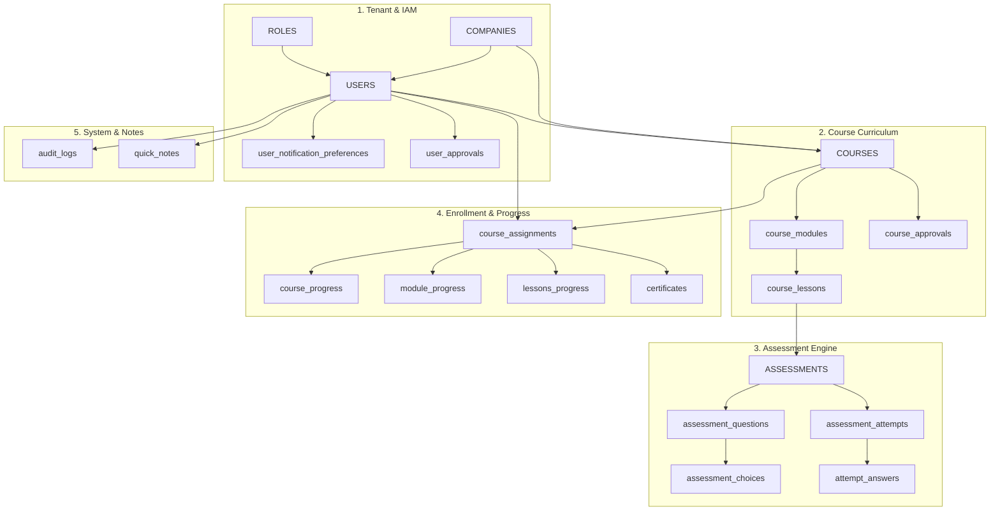
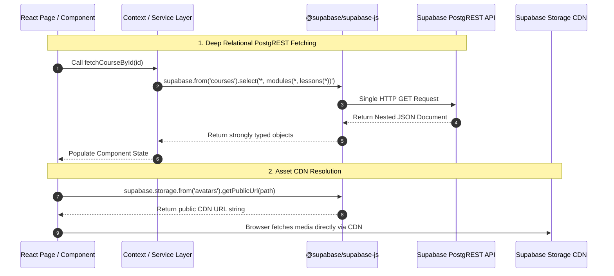

# Supabase Database: Tables, Rows, Columns & Data Fetching Guide

> [!NOTE]
> This document details all **18 database tables**, their **columns, data types, constraints, and row representations** in the Spark LMS Supabase database, along with the **architectural patterns used by the application to fetch and display data**.

---

## Part 1: Database Architecture & Entity Summary

Spark LMS organizes its PostgreSQL schema into **5 functional domains**:



---

### Domain 1: Multi-Tenancy & Identity Tables

#### 1. `companies`
- **What a row represents:** A tenant organization account (e.g. University, Enterprise client, School).
- **Primary Key:** `id` (`bigint`)
- **Columns & Data Types:**

| Column | Data Type | Constraints | Description |
|:---|:---|:---|:---|
| `id` | `bigint` | PK, Auto-increment | Unique identifier of the tenant company |
| `name` | `varchar` | NOT NULL | Display name (e.g. `"De La Salle University"`) |
| `slug` | `varchar` | NOT NULL, UNIQUE | Route slug for multi-tenancy (e.g. `"dlsu"`, `"eleksis"`) |
| `industry` | `varchar` | Nullable | E.g. `"Higher Education"`, `"Marketing"`, `"Aviation"` |
| `logo_url` | `varchar` | Nullable | Public URL to company logo in storage |
| `cover_photo_url` | `varchar` | Nullable | Public URL to company banner image |
| `website_url` | `varchar` | Nullable | Official company website URL |
| `year_founded` | `integer` | Nullable | Year established |
| `description` | `text` | Nullable | Overview of the tenant |
| `contact_person` | `varchar` | Nullable | Primary contact name |
| `contact_email` | `varchar` | Nullable | Contact email address |
| `phone_number` | `varchar` | Nullable | Contact phone number |
| `country` | `varchar` | Nullable | Country of operation |
| `office_address` | `text` | Nullable | Physical head office address |
| `is_archived` | `boolean` | DEFAULT `false` | Soft-delete flag |
| `archived_at` | `timestamptz`| Nullable | Timestamp of soft-delete |
| `archived_by` | `UUID` | FK ➔ `users(id)` | User who soft-deleted the record |

#### 2. `roles`
- **What a row represents:** A role definition controlling role-based access control (RBAC).
- **Primary Key:** `id` (`bigint`)
- **Columns & Data Types:**

| Column | Data Type | Constraints | Description |
|:---|:---|:---|:---|
| `id` | `bigint` | PK, Auto-increment | Unique role ID |
| `name` | `varchar` | NOT NULL, UNIQUE | Role identifier: `'user'`, `'creator'`, `'admin'`, `'spark_admin'` |

#### 3. `users`
- **What a row represents:** An individual application user profile linked directly to Supabase Auth (`auth.users`).
- **Primary Key:** `id` (`UUID` matching `auth.users.id`)
- **Columns & Data Types:**

| Column | Data Type | Constraints | Description |
|:---|:---|:---|:---|
| `id` | `UUID` | PK | Direct link to Supabase Auth `auth.users.id` |
| `company_id` | `bigint` | NOT NULL, FK ➔ `companies(id)` | Tenant organization ID |
| `role_id` | `bigint` | NOT NULL, FK ➔ `roles(id)` | Role permission level |
| `email` | `varchar` | NOT NULL, UNIQUE | User login email |
| `password` | `varchar` | NOT NULL | Legacy password field reference |
| `firstname` | `varchar` | NOT NULL | First name |
| `lastname` | `varchar` | NOT NULL | Last name |
| `middlename` | `varchar` | Nullable | Middle name / initial |
| `avatar_url` | `varchar` | Nullable | URL to avatar file in `avatars` bucket |
| `date_of_birth` | `date` | Nullable | Birth date |
| `gender` | `varchar` | Nullable | Gender |
| `contact_no` | `varchar` | Nullable | Phone number |
| `address` | `text` | Nullable | Home/work address |
| `employee_id` | `varchar` | Nullable | Tenant employee/student ID number |
| `department` | `varchar` | Nullable | Department / Faculty unit |
| `job_title` | `varchar` | Nullable | Job position or role title |
| `date_hired` | `date` | Nullable | Employment or enrollment date |
| `status` | `varchar` | DEFAULT `'active'` | `'active'`, `'pending'`, `'suspended'`, `'banned'`, `'rejected'`, `'reactivated'` |
| `created_at` | `timestamptz`| DEFAULT `now()` | Registration timestamp |
| `is_archived` | `boolean` | DEFAULT `false` | Soft-delete status |
| `archived_at` | `timestamptz`| Nullable | Soft-delete timestamp |
| `archived_by` | `UUID` | FK ➔ `users(id)` | User who archived this account |

#### 4. `user_approvals`
- **What a row represents:** An approval or rejection record for a tenant user registration.
- **Primary Key:** `id` (`bigint`)
- **Columns:** `id`, `user_id` (FK ➔ `users`), `approved_by` (FK ➔ `users`), `decision` (`varchar`), `reason` (`text`), `decided_at` (`timestamptz`).

#### 5. `user_notification_preferences`
- **What a row represents:** 1:1 notification delivery settings for an individual user.
- **Primary Key:** `id` (`bigint`)
- **Columns:** `id`, `user_id` (FK ➔ `users`, UNIQUE), `course_assigned` (`bool`), `course_reminder` (`bool`), `assessment_due` (`bool`), `certificate_earned` (`bool`), `announcements` (`bool`), `weekly_digest` (`bool`).

---

### Domain 2: Course Curriculum Tables

#### 6. `courses`
- **What a row represents:** A complete educational training course owned by a tenant.
- **Primary Key:** `id` (`bigint`)
- **Columns & Data Types:**

| Column | Data Type | Constraints | Description |
|:---|:---|:---|:---|
| `id` | `bigint` | PK, Auto-increment | Unique course ID |
| `company_id` | `bigint` | NOT NULL, FK ➔ `companies(id)` | Tenant owning this course |
| `title` | `varchar` | NOT NULL | Course title |
| `description` | `text` | Nullable | Detailed syllabus/course description |
| `thumbnail_url` | `varchar` | Nullable | Banner image URL in `course-thumbnails` bucket |
| `icon_emoji` | `varchar` | Nullable | Representative emoji icon |
| `created_by` | `UUID` | FK ➔ `users(id)` | Author user ID |
| `status` | `varchar` | DEFAULT `'draft'` | `'draft'`, `'published'`, `'archived'` |
| `created_at` | `timestamptz`| DEFAULT `now()` | Creation timestamp |
| `is_archived` | `boolean` | DEFAULT `false` | Soft-delete flag |
| `archived_at` | `timestamptz`| Nullable | Soft-delete timestamp |
| `archived_by` | `UUID` | FK ➔ `users(id)` | User who archived this course |

#### 7. `course_modules`
- **What a row represents:** A structured chapter or milestone within a course.
- **Primary Key:** `id` (`bigint`)
- **Columns:** `id`, `course_id` (FK ➔ `courses`), `title` (`varchar`), `order` (`integer`, sorting index), `description` (`text`), `created_at`, `is_archived`, `archived_at`, `archived_by`.

#### 8. `course_lessons`
- **What a row represents:** A single learning lesson or assessment unit inside a module.
- **Primary Key:** `id` (`bigint`)
- **Columns:**
  - `id` (`bigint`, PK)
  - `module_id` (`bigint`, FK ➔ `course_modules`)
  - `title` (`varchar`) — Lesson title
  - `type` (`varchar`, DEFAULT `'text'`) — `'video'`, `'reading'`, or `'assessment'`
  - `content` (`text`, Nullable) — Reading body text (HTML or Markdown)
  - `video_url` (`varchar`, Nullable) — Video stream or embed URL
  - `position` (`integer`, DEFAULT `1`) — Sorting sequence within the module
  - `created_at`, `is_archived`, `archived_at`, `archived_by`

#### 9. `course_approvals`
- **What a row represents:** Editorial review audit entry for releasing a course to learners.
- **Columns:** `id`, `course_id` (FK ➔ `courses`), `approver_id` (FK ➔ `users`), `decision` (`varchar`), `reason` (`text`), `decided_at` (`timestamptz`).

---

### Domain 3: Assessment & Quiz Tables

#### 10. `assessments`
- **What a row represents:** A quiz or examination instance linked 1:1 to an assessment lesson.
- **Primary Key:** `id` (`bigint`)
- **Columns:** `id`, `lesson_id` (FK ➔ `course_lessons`), `title` (`varchar`), `description` (`text`), `passing_score` (`integer`, default `70`), `time_limit` (`integer`, duration in seconds), `is_archived`, `archived_at`, `archived_by`.

#### 11. `assessment_questions`
- **What a row represents:** An individual question item inside an assessment.
- **Primary Key:** `id` (`bigint`)
- **Columns:**
  - `id` (`bigint`, PK)
  - `assessment_id` (`bigint`, FK ➔ `assessments`)
  - `question_text` (`text`, NOT NULL)
  - `position` (`integer`, DEFAULT `1`) — Question order index
  - `question_type` (`varchar`) — `'multiple_choice'`, `'true_false'`, `'identification'`, `'enumeration'`, `'essay'`
  - `correct_answers` (`text[]` or json) — Array of accepted correct answers

#### 12. `assessment_choices`
- **What a row represents:** An selectable option for a multiple-choice question.
- **Primary Key:** `id` (`bigint`)
- **Columns:** `id`, `question_id` (FK ➔ `assessment_questions`), `choice_text` (`text`), `is_correct` (`boolean`, DEFAULT `false`).

#### 13. `assessment_attempts`
- **What a row represents:** A user's submission attempt on an assessment.
- **Primary Key:** `id` (`bigint`)
- **Columns:** `id`, `assessment_id` (FK ➔ `assessments`), `user_id` (FK ➔ `users`), `score` (`integer`), `passed` (`boolean`), `attempted_at` (`timestamptz`).

#### 14. `attempt_answers`
- **What a row represents:** The specific choice selected by a user for a given question in an attempt.
- **Primary Key:** `id` (`bigint`)
- **Columns:** `id`, `attempt_id` (FK ➔ `assessment_attempts`), `question_id` (FK ➔ `assessment_questions`), `choice_id` (FK ➔ `assessment_choices`).

---

### Domain 4: Enrollment, Progress & Certification Tables

#### 15. `course_assignments`
- **What a row represents:** An active or archived enrollment linking a user to a course.
- **Primary Key:** `id` (`bigint`)
- **Columns:** `id`, `user_id` (FK ➔ `users`), `course_id` (FK ➔ `courses`), `assigned_by` (FK ➔ `users`), `assigned_at` (`timestamptz`), `status` (`'not_started'`, `'ongoing'`, `'completed'`), `is_archived`, `archived_at`, `archived_by`.

#### 16. `course_progress`
- **What a row represents:** Aggregated total progress for a user's course enrollment.
- **Primary Key:** `id` (`bigint`)
- **Columns:** `id`, `assignment_id` (FK ➔ `course_assignments`, UNIQUE), `progress_pct` (`integer`, `0` to `100`), `is_completed` (`boolean`), `completed_at` (`timestamptz`).

#### 17. `module_progress` & `lessons_progress`
- **What each row represents:** Granular completion tracking per module or individual lesson.
- **`module_progress` Columns:** `id`, `assignment_id` (FK), `module_id` (FK ➔ `course_modules`), `is_completed` (`boolean`), `completed_at` (`timestamptz`).
- **`lessons_progress` Columns:** `id`, `assignment_id` (FK), `lesson_id` (FK ➔ `course_lessons`), `is_completed` (`boolean`), `completed_at` (`timestamptz`).

#### 18. `certificates`
- **What a row represents:** A verifiable completion certificate awarded upon 100% course completion.
- **Primary Key:** `id` (`bigint`)
- **Columns:** `id`, `assignment_id` (FK ➔ `course_assignments`, UNIQUE), `certificate_url` (`varchar`), `issued_at` (`timestamptz`).

---

### Domain 5: System & Collaboration Tables
- **`audit_logs`**: System audit trail (`id`, `user_id`, `action`, `table_name`, `record_id`, `old_value`, `new_value`, `created_at`).
- **`quick_notes`**: User scratchpad during lessons (`id`, `user_id`, `lesson_id`, `content`, `updated_at`).

---

## Part 2: How the System Fetches and Displays Data

Spark LMS retrieves and updates data using the official `@supabase/supabase-js` client configured in [`src/lib/supabase.ts`](file:///c:/Users/yani/Documents/spark-lms/spark-lms/src/lib/supabase.ts). Data fetching follows four main patterns:



---

### 1. Single-Roundtrip Relational Joins (PostgREST)
Instead of executing multiple roundtrip queries to fetch related entities (avoiding N+1 database queries), the application uses PostgREST foreign key joins in the `.select()` query.

#### Example A: User Profile + Role + Company ([`AuthContext.tsx`](file:///c:/Users/yani/Documents/spark-lms/spark-lms/src/context/AuthContext.tsx#L68-L76))
Upon user login, a single request fetches the user record, unpacks their role name from `roles`, and joins the tenant organization from `companies`:
```typescript
const { data: userData, error } = await supabase
  .from('users')
  .select(`
    *,
    roles(name),
    companies!users_company_id_fkey(*)
  `)
  .eq('email', email)
  .single();
```

#### Example B: Deep Course Curriculum Tree ([`courseCreatorService.ts`](file:///c:/Users/yani/Documents/spark-lms/spark-lms/src/services/courseCreatorService.ts#L98-L135))
When the Course Builder loads, it fetches the course, all modules sorted by `order`, and every nested lesson in one query:
```typescript
const { data: course } = await supabase
  .from('courses')
  .select(`
    *,
    modules:course_modules(
      *,
      lessons:course_lessons(*)
    )
  `)
  .eq('id', courseId)
  .order('order', { foreignTable: 'course_modules', ascending: true });
```

---

### 2. Multi-Tenant Scoped Filtering
In the learner, creator, and admin portals, routes contain the tenant company slug (e.g. `/:company/dashboard`).
The active company ID is extracted from [`AuthContext`](file:///c:/Users/yani/Documents/spark-lms/spark-lms/src/context/AuthContext.tsx) and attached to queries using `.eq('company_id', company.id)`.

#### Fast Head Counts ([`Dashboard.tsx`](file:///c:/Users/yani/Documents/spark-lms/spark-lms/src/pages/Admin/Dashboard.tsx#L49-L55))
For dashboard summary cards, the app requests counts using `{ count: 'exact', head: true }`. This returns the aggregate count without downloading row data:
```typescript
const { count: usersCount } = await supabase
  .from('users')
  .select('*', { count: 'exact', head: true })
  .eq('company_id', company.id);
```

---

### 3. Safe Upsert Patterns for Learner Progress
When a learner views a lesson or completes a video, progress is recorded via **upsert** (`INSERT ... ON CONFLICT DO UPDATE`). This guarantees that refreshing or revisiting a lesson safely updates `completed_at` without throwing duplicate primary key errors:

```typescript
// src/pages/User/ModuleAttempts.tsx
await supabase.from('lessons_progress').upsert({
  assignment_id: assignmentId,
  lesson_id: lessonId,
  is_completed: true,
  completed_at: new Date().toISOString()
});
```

---

### 4. Storage CDN Media Resolution
Media files (avatars and course thumbnails) are kept out of table columns to keep the database light and fast:
1. Files are uploaded via `supabase.storage.from('course-thumbnails').upload(path, file)`.
2. Supabase returns a public CDN endpoint via `supabase.storage.from('course-thumbnails').getPublicUrl(path)`.
3. The resulting CDN URL string is stored in the database column (`courses.thumbnail_url` or `users.avatar_url`).
4. React components display the image directly via standard ``.
