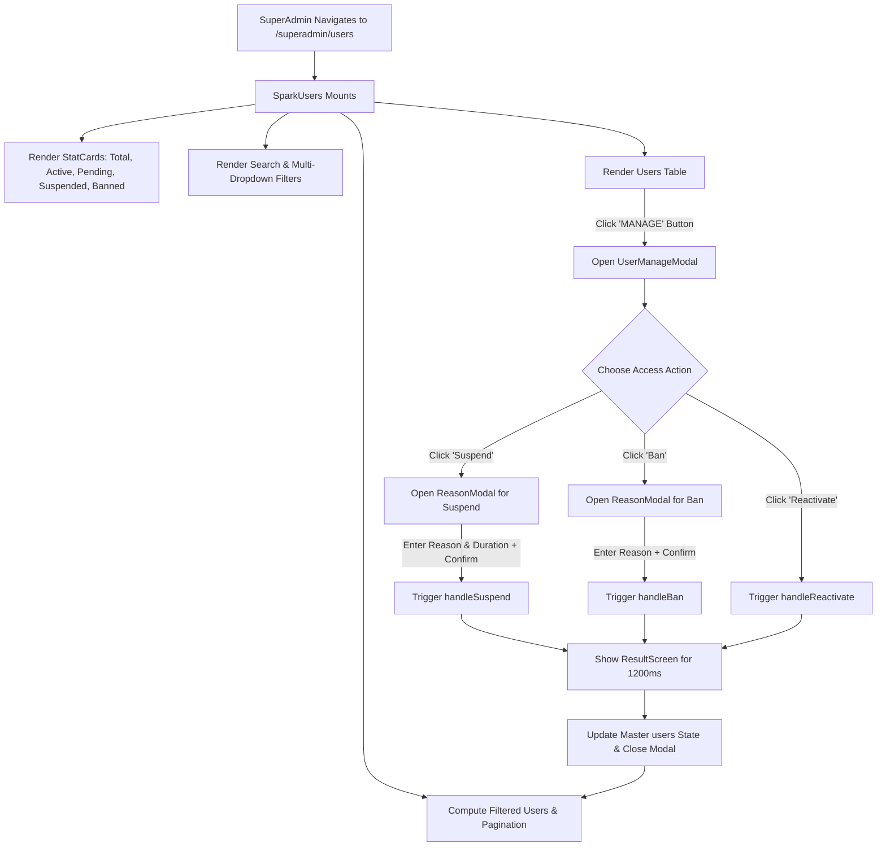

# Users Module — Function & Component Documentation

> [!NOTE]
> This document provides an exhaustive reference of every component, function, hook, state variable, and data structure within the **SuperAdmin Users** module located at [`src/pages/SuperAdmin/Users/SparkUsers.jsx`](file:///c:/Users/yani/Documents/spark-lms/spark-lms/src/pages/SuperAdmin/Users/SparkUsers.jsx).

---

## Directory & File Structure

```
src/pages/SuperAdmin/Users/
├── SparkUsers.jsx                ← All-in-one SuperAdmin Users management view
└── users_module_documentation.md ← This reference document
```

### Module Context & Responsibilities
- **Global User Directory**: Displays users across all tenant organizations.
- **Search & Multi-Facet Filtering**: Real-time search across names, emails, usernames, and employee IDs, combined with multi-dropdown filtering (Company, Department, Approval Date, Status).
- **KPI Metrics**: Real-time KPI summary stat cards (Total, Active, Pending, Suspended, Banned).
- **User Detail & Profile Modal**: Rich modal presenting user identity credentials, personal data, contact details, and assigned courses.
- **Access Control & Lifecycle Actions**: Suspend (with duration + mandatory reason), Ban (with mandatory reason), and Reactivate user accounts.
- **Table Presentation**: Paginated tabular display with tenant color-coded avatar pills, company badges, and integrated `StatusAndDateCell`.

---

## 1. Components Overview

| Component | Line Range | Props | Purpose |
|:---|:---:|:---|:---|
| [`Select`](#1-select) | [L16–64](file:///c:/Users/yani/Documents/spark-lms/spark-lms/src/pages/SuperAdmin/Users/SparkUsers.jsx#L16-L64) | `value`, `onChange`, `options`, `placeholder`, `isDark` | Reusable dark-mode aware styled dropdown select with SVG chevron. |
| [`StatCard`](#2-statcard) | [L69–130](file:///c:/Users/yani/Documents/spark-lms/spark-lms/src/pages/SuperAdmin/Users/SparkUsers.jsx#L69-L130) | `label`, `value`, `accent`, `topBorderColor`, `icon`, `sub`, `subColor` | Top metric card displaying counts, trend indicators, and colored icon badges. |
| [`ReasonModal`](#3-reasonmodal) | [L135–311](file:///c:/Users/yani/Documents/spark-lms/spark-lms/src/pages/SuperAdmin/Users/SparkUsers.jsx#L135-L311) | `actionLabel`, `actionColor`, `onConfirm`, `onCancel`, `theme` | Dialog prompting for a mandatory reason and duration (for suspension). |
| [`ResultScreen`](#4-resultscreen) | [L316–372](file:///c:/Users/yani/Documents/spark-lms/spark-lms/src/pages/SuperAdmin/Users/SparkUsers.jsx#L316-L372) | `action` | Animated success check/icon confirmation screen inside modal. |
| [`ModalField`](#5-modalfield) | [L374–391](file:///c:/Users/yani/Documents/spark-lms/spark-lms/src/pages/SuperAdmin/Users/SparkUsers.jsx#L374-L391) | `label`, `value` | Read-only input field widget inside user profile modal. |
| [`SectionTitle`](#6-sectiontitle) | [L393–406](file:///c:/Users/yani/Documents/spark-lms/spark-lms/src/pages/SuperAdmin/Users/SparkUsers.jsx#L393-L406) | `title` | Uppercase section heading in modal cards. |
| [`UserManageModal`](#7-usermanagemodal) | [L408–780](file:///c:/Users/yani/Documents/spark-lms/spark-lms/src/pages/SuperAdmin/Users/SparkUsers.jsx#L408-L780) | `user`, `onClose`, `onSuspend`, `onBan`, `onReactivate`, `theme` | Two-column detailed user inspection, credentials, and access management modal. |
| [`SparkUsers`](#8-sparkusers-main-component) | [L785–1518](file:///c:/Users/yani/Documents/spark-lms/spark-lms/src/pages/SuperAdmin/Users/SparkUsers.jsx#L785-L1518) | — | Main orchestrator page component. |

---

## 2. Component Details & Functions

### 1. `Select`
- **Location**: [SparkUsers.jsx: L16–64](file:///c:/Users/yani/Documents/spark-lms/spark-lms/src/pages/SuperAdmin/Users/SparkUsers.jsx#L16-L64)
- **Props**:
  - `value` (`string | number`): Current selected value.
  - `onChange` (`(val: string) => void`): Callback fired on select change.
  - `options` (`Array<{ value: string|number, label: string }>`): Options list.
  - `placeholder` (`string` optional): Initial placeholder item text.
  - `isDark` (`boolean`): Theme flag enabling native dark select popup menu styling (`colorScheme: isDark ? "dark" : "light"`).
- **Internal Handlers**:
  - `onFocus`: Accents border color with `var(--accent)`.
  - `onBlur`: Resets border color to `var(--line)`.

---

### 2. `StatCard`
- **Location**: [SparkUsers.jsx: L69–130](file:///c:/Users/yani/Documents/spark-lms/spark-lms/src/pages/SuperAdmin/Users/SparkUsers.jsx#L69-L130)
- **Props**:
  - `label` (`string`): Metric label (e.g., "Total Users", "Active", "Pending").
  - `value` (`number`): The numerical count to display.
  - `accent` (`string`): CSS color variable or hex for the icon container.
  - `topBorderColor` (`string` optional): 3px top highlight border color.
  - `icon` (`ReactNode`): SVG icon element.
  - `sub` (`string` optional): Subtext / badge text (e.g., "↑ +12% this month").
  - `subColor` (`string` optional): Color for subtext (defaults to `var(--green)`).
- **Styling Highlights**: Uses `color-mix(in srgb, ${accent} 14%, transparent)` for harmonious icon backgrounds in both dark and light modes.

---

### 3. `ReasonModal`
- **Location**: [SparkUsers.jsx: L135–311](file:///c:/Users/yani/Documents/spark-lms/spark-lms/src/pages/SuperAdmin/Users/SparkUsers.jsx#L135-L311)
- **Props**:
  - `actionLabel` (`"Suspend" | "Ban"`): Label used in titles and buttons.
  - `actionColor` (`string`): Button accent color (`var(--gold)` for Suspend, `var(--red-strong)` for Ban).
  - `onConfirm` (`({ reason, duration }: { reason: string, duration: string }) => void`): Callback executed when confirmed.
  - `onCancel` (`() => void`): Callback to dismiss modal.
  - `theme` (`"light" | "dark"`): Applied via `data-sa-theme`.
- **State**:
  - `reason` (`string`): Mandatory reason text entered by super admin.
  - `duration` (`string`): Selected suspension duration (`"1 week"`, `"2 weeks"`, `"1 month"`, `"3 months"`). Default is `"1 week"`.
- **Functions & Hooks**:
  - `useEffect` ([L141–146](file:///c:/Users/yani/Documents/spark-lms/spark-lms/src/pages/SuperAdmin/Users/SparkUsers.jsx#L141-L146)): Sets `document.body.style.overflow = "hidden"` on mount and restores on unmount to prevent page scroll bleed.
  - `onConfirm({ reason, duration })` ([L286](file:///c:/Users/yani/Documents/spark-lms/spark-lms/src/pages/SuperAdmin/Users/SparkUsers.jsx#L286)): Guarded by `reason.trim()`; submits values and closes dialog.

---

### 4. `ResultScreen`
- **Location**: [SparkUsers.jsx: L316–372](file:///c:/Users/yani/Documents/spark-lms/spark-lms/src/pages/SuperAdmin/Users/SparkUsers.jsx#L316-L372)
- **Props**:
  - `action` (`"suspended" | "banned" | "reactivated"`): Type of action executed.
- **Description**: Displays a stylized status icon with background badge color and localized confirmation string:
  - `"suspended"`: Amber circle with pause/exclamation icon, `"User suspended."`.
  - `"banned"`: Red circle with X/cross lines, `"User banned."`.
  - `"reactivated"`: Green circle with checkmark polyline, `"User reactivated!"`.

---

### 5. `ModalField` & `SectionTitle`
- **Location**: [SparkUsers.jsx: L374–406](file:///c:/Users/yani/Documents/spark-lms/spark-lms/src/pages/SuperAdmin/Users/SparkUsers.jsx#L374-L406)
- **Props**:
  - `ModalField`: `label` (`string`), `value` (`string | number | undefined`)
  - `SectionTitle`: `title` (`string`)
- **Description**: Presentation primitives formatting read-only profile inputs with empty fallback (`"—"`), and section headings.

---

### 6. `UserManageModal`
- **Location**: [SparkUsers.jsx: L408–780](file:///c:/Users/yani/Documents/spark-lms/spark-lms/src/pages/SuperAdmin/Users/SparkUsers.jsx#L408-L780)
- **Props**:
  - `user` (`Object`): Complete user record object being inspected.
  - `onClose` (`() => void`): Callback to dismiss modal.
  - `onSuspend` (`(user, reason, duration) => void`): Callback to suspend account.
  - `onBan` (`(user, reason) => void`): Callback to ban account.
  - `onReactivate` (`(user) => void`): Callback to reactivate suspended account.
  - `theme` (`"light" | "dark"`): Current theme.
- **State**:
  - `action` (`"suspended" | "banned" | "reactivated" | null`): When populated, renders `ResultScreen` transition.
  - `showReason` (`"suspend" | "ban" | null`): Controls child `ReasonModal` visibility.
- **Functions**:
  | Function | Line | Parameters | Description |
  |:---|:---:|:---|:---|
  | `handleSuspend` | [L423](file:///c:/Users/yani/Documents/spark-lms/spark-lms/src/pages/SuperAdmin/Users/SparkUsers.jsx#L423) | `{ reason, duration }` | Closes `showReason`, activates `action = "suspended"`, waits 1200ms for visual feedback, triggers `onSuspend`, then closes modal. |
  | `handleBan` | [L431](file:///c:/Users/yani/Documents/spark-lms/spark-lms/src/pages/SuperAdmin/Users/SparkUsers.jsx#L431) | `{ reason }` | Closes `showReason`, activates `action = "banned"`, waits 1200ms, triggers `onBan`, then closes modal. |
  | `handleReactivate` | [L439](file:///c:/Users/yani/Documents/spark-lms/spark-lms/src/pages/SuperAdmin/Users/SparkUsers.jsx#L439) | — | Activates `action = "reactivated"`, waits 1200ms, triggers `onReactivate`, then closes modal. |
- **Computed Permissions**:
  - `canSuspend`: `["Active", "Reactivated"].includes(user.status)`
  - `canBan`: `user.status !== "Banned"`
  - `canReactivate`: `user.status === "Suspended"`

---

### 7. `SparkUsers` (Main Component)
- **Location**: [SparkUsers.jsx: L785–1518](file:///c:/Users/yani/Documents/spark-lms/spark-lms/src/pages/SuperAdmin/Users/SparkUsers.jsx#L785-L1518)
- **Props**: None.

#### State Variables
| State Variable | Initial Value | Type | Description |
|:---|:---:|:---:|:---|
| `users` | `MOCK_ALL_USERS` | `Array<User>` | Master array of user records across all tenant companies. |
| `manageUser` | `null` | `User \| null` | The user object currently opened in `UserManageModal`. |
| `page` | `1` | `number` | Active pagination page. |
| `search` | `""` | `string` | Free-text search query. |
| `companyFilter` | `""` | `string` | Filter for company ID. |
| `deptFilter` | `""` | `string` | Filter for department name. |
| `statusFilter` | `""` | `string` | Filter for account status. |
| `dateFilter` | `""` | `string` | Filter for approval age in days (`"7"`, `"14"`, `"30"`, `"90"`). |

#### Functions & Hooks in `SparkUsers`

| Function / Hook | Line | Parameters / Dependencies | Description |
|:---|:---:|:---|:---|
| `filtered` (`useMemo`) | [L800–825](file:///c:/Users/yani/Documents/spark-lms/spark-lms/src/pages/SuperAdmin/Users/SparkUsers.jsx#L800-L825) | `[users, search, companyFilter, deptFilter, statusFilter, dateFilter]` | Applies multi-criteria filtering pipeline: <br>• Case-insensitive search on `name`, `email`, `username`, `employeeId`.<br>• Exact numeric match on `companyId`.<br>• Exact match on `department`.<br>• Exact match on `status`.<br>• Age calculation `(now - new Date(approvedOn)) / 86400000 <= days`. |
| `updateUser` | [L838–839](file:///c:/Users/yani/Documents/spark-lms/spark-lms/src/pages/SuperAdmin/Users/SparkUsers.jsx#L838-L839) | `id` (number), `patch` (object) | Immutable state update helper. Finds user by `id` in `users` state and applies `patch` properties. |
| `handleSuspend` | [L841–842](file:///c:/Users/yani/Documents/spark-lms/spark-lms/src/pages/SuperAdmin/Users/SparkUsers.jsx#L841-L842) | `u` (user), `reason` (string), `duration` (string) | Suspends the user: calls `updateUser` setting `status: "Suspended"`, `suspendReason: reason`, and `suspendDuration: duration`. |
| `handleBan` | [L843–844](file:///c:/Users/yani/Documents/spark-lms/spark-lms/src/pages/SuperAdmin/Users/SparkUsers.jsx#L843-L844) | `u` (user), `reason` (string) | Permanently bans the user: calls `updateUser` setting `status: "Banned"` and `banReason: reason`. |
| `handleReactivate` | [L845–846](file:///c:/Users/yani/Documents/spark-lms/spark-lms/src/pages/SuperAdmin/Users/SparkUsers.jsx#L845-L846) | `u` (user) | Reactivates suspended user: calls `updateUser` setting `status: "Reactivated"` and clearing `suspendReason: null`. |
| `getPages` | [L848–853](file:///c:/Users/yani/Documents/spark-lms/spark-lms/src/pages/SuperAdmin/Users/SparkUsers.jsx#L848-L853) | — | Builds dynamic pagination numbering with `...` truncations based on `totalPages` and `safePage`. |
| `pgBtn` | [L855–868](file:///c:/Users/yani/Documents/spark-lms/spark-lms/src/pages/SuperAdmin/Users/SparkUsers.jsx#L855-L868) | `disabled` (boolean) | Returns dynamic inline CSS style dictionary for pagination buttons. |
| `getUserStatusDate` | [L873–895](file:///c:/Users/yani/Documents/spark-lms/spark-lms/src/pages/SuperAdmin/Users/SparkUsers.jsx#L873-L895) | `user` (object) | Formats the secondary date text for the `StatusAndDateCell`:<br>1. Uses explicit status timestamp if present (`suspendedDate`, `bannedDate`, `statusChangedDate`).<br>2. For Suspended / Banned: prefixes `"Approved "` with `user.approvedOn`.<br>3. For Active / Reactivated: returns `user.approvedOn`.<br>4. For Pending: returns `user.createdOn` or muted `—`. |

---

## 3. Data Models & Constants

### Constants
- `ITEMS_PER_PAGE`: `8` (pagination size).
- `COMPANIES_LIST`: List of tenant companies with `id`, `name`, `abbr`, `color`.
- `DEPARTMENTS_LIST`: Standard departments (`"Engineering"`, `"Marketing"`, `"HR"`, `"Technical"`, `"Finance"`, `"Operations"`).

### User Object Schema (`MOCK_ALL_USERS`)

```typescript
interface User {
  id: number;
  company: string;            // e.g. "De La Salle University"
  companyId: number;          // Foreign key matching COMPANIES_LIST
  companyColor: string;       // Hex color for tenant branding
  companyAbbr: string;        // Abbreviation for badge (e.g. "DLSU")
  name: string;               // Full display name
  email: string;              // Work email
  username: string;           // Login username
  password: string;           // Password (displayed in profile credentials)
  lastName: string;           // Last name
  firstName: string;          // First name
  middleName: string;         // Middle name / initial
  employeeId: string;         // e.g. "22-1001"
  dateOfBirth: string;        // Formatted birth date
  jobTitle: string;           // Role / job designation
  gender: "Male" | "Female" | "Other";
  department: string;         // e.g. "Engineering"
  phone: string;              // Contact number
  status: "Active" | "Pending" | "Suspended" | "Banned" | "Rejected" | "Reactivated";
  approvedOn: string | null;  // Date user was approved (e.g. "Jan 05 2026")
  createdOn: string;          // Date registration was submitted
  suspendReason?: string;     // Reason given upon suspension
  suspendDuration?: string;   // Duration selected upon suspension
  banReason?: string;         // Reason given upon ban
  assignedCourses: string[];  // Array of enrolled course title strings
}
```

---

## 4. UI Interaction & Flow


